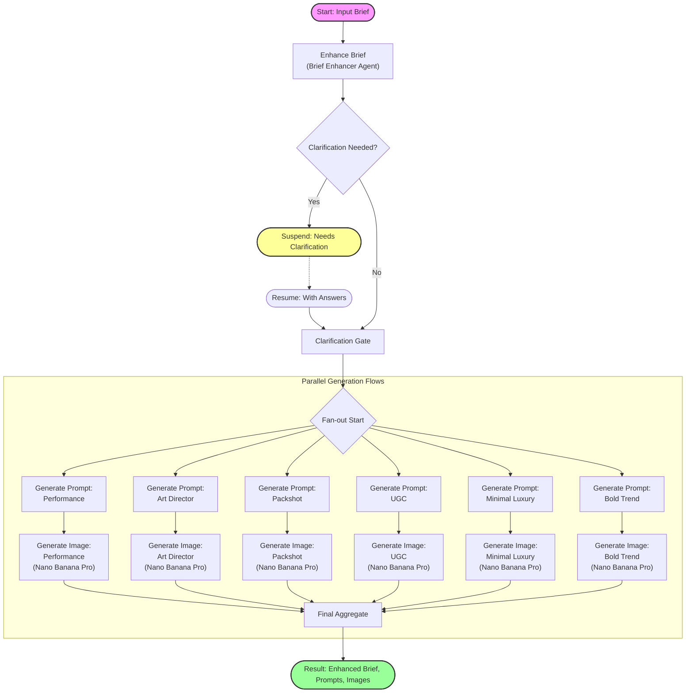

# Creative Fanout Workflow Diagram

```mermaid
graph TD
    Start([Start: Input Brief]) --> EnhanceBrief["Enhance Brief<br/>(Brief Enhancer Agent)"]
    
    EnhanceBrief --> ClarificationCheck{Clarification Needed?}
    
    ClarificationCheck -- Yes --> Suspend([Suspend: Needs Clarification])
    Suspend -.-> Resume([Resume: With Answers])
    Resume --> ClarificationGate[Clarification Gate]
    ClarificationCheck -- No --> ClarificationGate
    
    ClarificationGate --> FanOut{Fan-out Start}
    
    %% Parallel Flows per Persona
    subgraph FanOutFlows [Parallel Generation Flows]
        direction TB
        
        %% Performance Flow
        FanOut --> GenPerf[Generate Prompt:<br/>Performance]
        GenPerf --> ImgPerf["Generate Image:<br/>Performance<br/>(Nano Banana Pro)"]
        ImgPerf --> FinalAgg
        
        %% Art Director Flow
        FanOut --> GenArt[Generate Prompt:<br/>Art Director]
        GenArt --> ImgArt["Generate Image:<br/>Art Director<br/>(Nano Banana Pro)"]
        ImgArt --> FinalAgg
        
        %% Packshot Flow
        FanOut --> GenPack[Generate Prompt:<br/>Packshot]
        GenPack --> ImgPack["Generate Image:<br/>Packshot<br/>(Nano Banana Pro)"]
        ImgPack --> FinalAgg
        
        %% UGC Flow
        FanOut --> GenUGC[Generate Prompt:<br/>UGC]
        GenUGC --> ImgUGC["Generate Image:<br/>UGC<br/>(Nano Banana Pro)"]
        ImgUGC --> FinalAgg
        
        %% Minimal Luxury Flow
        FanOut --> GenLux[Generate Prompt:<br/>Minimal Luxury]
        GenLux --> ImgLux["Generate Image:<br/>Minimal Luxury<br/>(Nano Banana Pro)"]
        ImgLux --> FinalAgg
        
        %% Bold Trend Flow
        FanOut --> GenBold[Generate Prompt:<br/>Bold Trend]
        GenBold --> ImgBold["Generate Image:<br/>Bold Trend<br/>(Nano Banana Pro)"]
        ImgBold --> FinalAgg
    end
    
    FinalAgg[Final Aggregate] --> Result([Result: Enhanced Brief, Prompts, Images])
    
    style Start fill:#f9f,stroke:#333,stroke-width:2px
    style Suspend fill:#ff9,stroke:#333,stroke-width:2px
    style Result fill:#9f9,stroke:#333,stroke-width:2px
```
